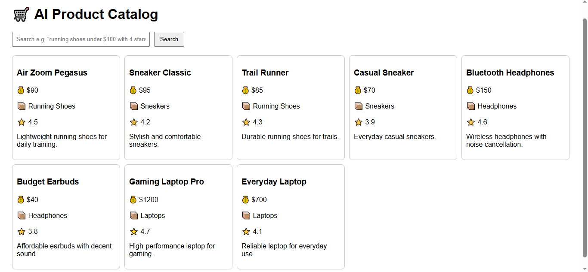
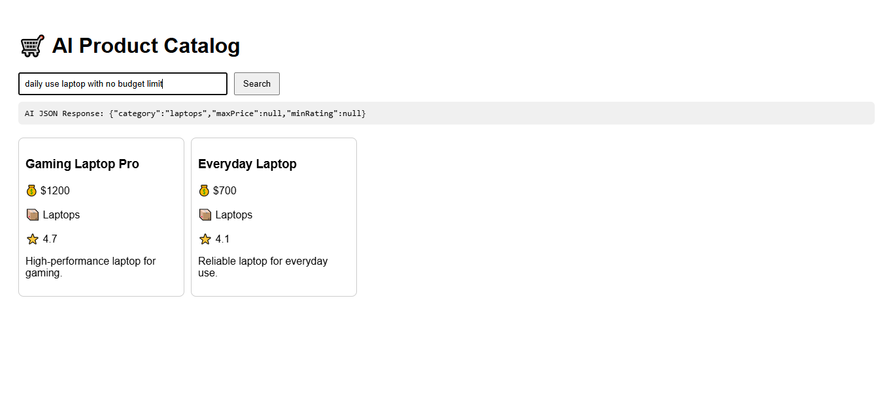

# AI Product Catalog

## How to run the app

1. Clone the repository and open the project folder.  
2. Run `npm install` to install dependencies.  
3. Create a `.env` file in the root folder with your OpenAI API key:

4. Run `npm run dev` to start the development server.  
5. Open `http://localhost:5173` in your browser.

---

## What AI feature I built

I integrated **smart natural language search** powered by OpenAI.  
Users can type queries like:

> "running shoes under $100 with good reviews"

The AI extracts filters such as category, max price, and rating, then dynamically filters the product list to show relevant results. This makes searching intuitive and user-friendly.

---

## Demo screenshots

### Home page with product catalog

### Search results for "daily use laptop with no budget limit"

---

## Tools and libraries I used

- React for UI  
- Vite for development server  
- OpenAI API for natural language processing  
- JavaScript & CSS for logic and styling

---

## Notes and assumptions

- Products are static JSON data for simplicity.  
- The OpenAI API key is stored securely in `.env` (excluded from the repo).  
- AI output is expected as JSON with filters for category, max price, and rating.  
- No user profiles or dynamic pricing features included in this demo.

---

Thank you for reviewing my project! Please reach out if you have any questions or feedback.
